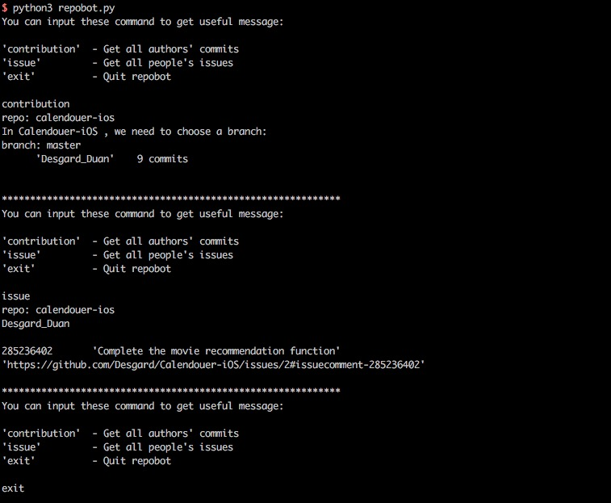

# Repobot

> shiyanlou.com 周报自动化生成脚本


## Screenshot



## Introduction

`Repobot` is a automatically generate weekly robots. Repobot - **Report Robot**. If your work flow is running on Github, Repobot can catch all commits in the specified time period, and we can get the contributions of everyone. If your work relies on the issue and comment on Github, Repobot can catch all comments in the specified time period in a issue. And then catch all comments of someone, this represents the work contribution.

## Usage

```bash 
$ git clone https://github.com/Desgard/Repobot.git
$ cd Repobot
$ source repobot-lenv/bin.activity
$ python3 repobot.py
```

Input your `username` and `password`, you can get the data!

## Dependent

You need to install `PyGithub`. 

```bash
$ pip3 install PyGithub
```

## MIT License

Copyright (c) 2017 Desgard_Duan

Permission is hereby granted, free of charge, to any person obtaining a copy
of this software and associated documentation files (the "Software"), to deal
in the Software without restriction, including without limitation the rights
to use, copy, modify, merge, publish, distribute, sublicense, and/or sell
copies of the Software, and to permit persons to whom the Software is
furnished to do so, subject to the following conditions:

The above copyright notice and this permission notice shall be included in all
copies or substantial portions of the Software.
